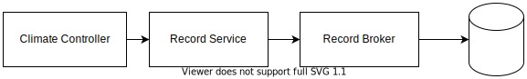

# Room Climate Record
A .Net 6 Web API that recives records of rooms climate conditions from Iot Devices

## Architecture

## API
| Http        | URI         | Action                 |
| :---------- | :-------    | :--------------------- |
| `Get`       |"api/Record" |  Returns all Records   |
| `Post`      |"api/Record" |  Creates a new Record  |

## Record Model

| Attribute     | Type     | Required               | Description           |
| :----------   | :------- | :--------------------- | :-------------------- |
| `Id`          | Guint    |                        |                       |
| `Stamp`       | DateTime | **{dotted-circle}** Yes| Date and time, when measurements were taken |
| `Motion`      | bool     | **{dotted-circle}** No | Set to `True` if motion was detected |
| `Temperature` | short    | **{dotted-circle}** No | Temperature in `celsius` |
| `Humidity`    | short    | **{dotted-circle}** No | Level of Humidity from 0 to 100 (%) |
